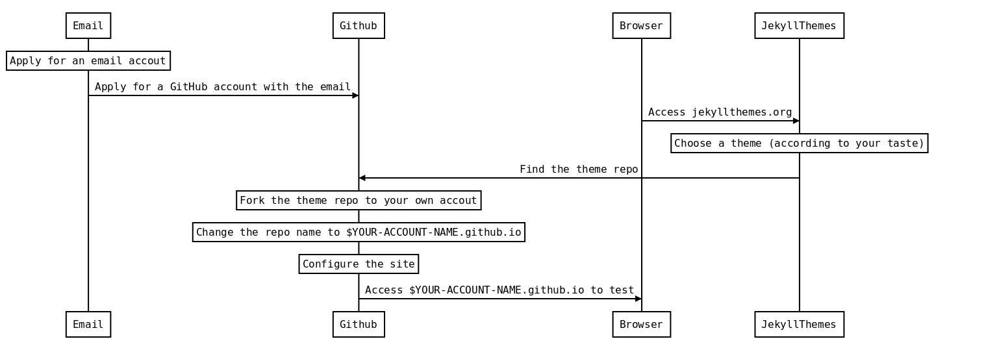
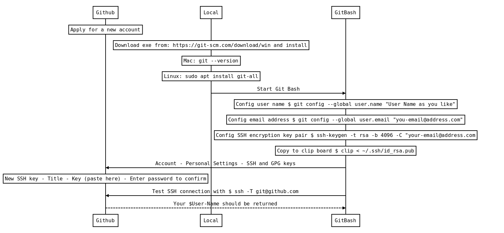
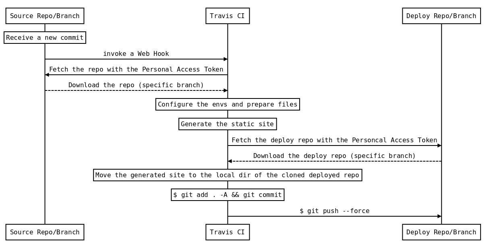

## 如何利用 GitHub 建立有品味的博客

#### Static Site with GitHub Pages in Style

---

## 演示文稿：LunchTalk.tk

## Slides: LunchTalk.tk

---

## 简介 Intro

- 十分钟零成本从零开始上线一个有品味的博客。（需要 Markdown 文档编辑基础）|
- 如何为这个博客添砖加瓦，增加功能与内容。（根据能力和需求选择使用）|
- 利用 Hexo 配合 Travis-CI，创建一个能够充分自定义各种功能的，没有环境依赖，自动编译的博客系统。（需要 GitHub 使用经验，h5、js、css 等前端基础）|

---

## 演示 Demo

- 注册邮箱 |
- 注册 GitHub 帐号并验证邮箱 |
- 在 jekyllthemes.org 上挑选主题（品味！） |
- 复制过来并修改代码库的名字 |
- 修改配置文件后访问测试 lumitalk.github.io |

---

## 建站流程

Create a web site with GitHub Pages (User) from scratch

---

## 为什么要做博客？

Why still blogging?

- 博客或者说个人网站的主要作用 |
   - 省时省力的自我介绍 |
   - 知识与经验的积累整理与补充（外脑）|
   - 分享、讨论、观点碰撞、避免回声 |
- 知识经济主要平台已经出现垄断：知乎（专栏）、微信公众号、Medium |

---

## 为什么要用静态网站做？

Why static site?

- 静态网站的优点：易使用、安全、低成本 |
- 静态网站的局限：没有动态，没有数据库，没有后端 |
- 当前方案的组成：GitHub Pages + Jekyll + Markdown + JavaScript |
- GitHub 是程序员（广义）的技术平台和生态链 |
- 总之：免费 + 有用 + 能学到东西 |

---

## 网站示例 Examples

 

- 示例：数学、学术向 [Optimization](http://www.quxiaofeng.me/optimization) （海量公式和边注）
- 示例：程序算法向 [zhuyingtai.ml](http://www.zhuyingtai.ml) （数学公式、代码高亮、图片、文本）
- 示例：简洁大方 [Doorknob](http://www.quxiaofeng.me/doorknob)（One Page）
- 示例：另类学术 [Web 版论文](http://www.quxiaofeng.me/lps/lps) vs [原版论文](http://www.quxiaofeng.me/docs/tsmc-linear-palmprint.pdf) （公式、图表、参考文献）

---

## 为什么这么弄？

Why this way?

- GitHub Pages 的免费空间 |
   - User: $USER-NAME.github.io repo, master branch; Project: any repo, gh-pages branch（默认选项，可以修改） |
- 静态网站生成器 staticgen.com |
   - Jekyll 源代码 + GitHub Pages 自动编译 |
   - 静态网站生成器生成 HTML + GitHub Pages 托管 |
- 聚焦内容 Markdown
- 表现力 HTML 5 + CSS 3 + JavaScript |

---

## 接下来？本地撰写

Follow-ups

- 简介代码目录结构 |
   - github.com/quxiaofeng/doorknob |
   - github.com/quxiaofeng/optimization |
- 配置 _config.yml |
- 本地 Git 环境（见后页） |
- 顺手配一个域名吧 freenom.com（流程见再后页） |
- freenom.com 免费顶级域名：不可靠，但适合临时使用 |

---

## 本地 Git 环境

Set up local GitHub env

---

## 配置域名 Domain name

- 检索没被占用的域名 freenom.com（科学上网） |
- 注册域名 |
- 填写域名信息：转发或者 DNS |
   - A, 600, 192.30.252.154 |
   - A, 600, 192.30.252.153 |
   - WWW, CNAME, 600, 用户名.github.io |
- GitHub repo 上：CNAME 文件 www.lumitalk.ml |
- 十分钟后测试 lumitalk.ml|

---

## 再怎么弄？添加内容

Then what? Articles!

- 用 Markdown 写文章。[Markdown 的格式支持演示](https://guides.github.com/features/mastering-markdown/)
- 网站细节需要调整的可以参考 [Jekyll 格式参考](https://jekyllrb.com/docs/posts/)
- Markdown 做演示 [示例](https://gitpitch.com/quxiaofeng/gitpitch-talks/20180509-static-site-for-lumi) [源码](https://github.com/quxiaofeng/hexo-site-3p0/blob/gitpitch/PITCHME.md) [制作方法](https://gitpitch.com/)
- 其它的例子
  - [跨计算机/浏览器/手机的个人收藏夹](http://quxiaofeng.me/links) [source](https://raw.githubusercontent.com/quxiaofeng/hexo-site-3p0/master/source/links.md)
  - [剑桥计算机系 - 论文列表](http://www.cl.cam.ac.uk/~dc552/) [[剑桥网页模板](https://github.com/davidchisnall/camtemplate)]
  - 个人代码库
  - 程序或前端或设计师作品集 Portfolio: [1](https://lenpaul.github.io/portfolio-jekyll-theme/), [2](http://drksephy.github.io/#projects), [3](http://newhaven.io/blog/)

---

## 还能怎么弄？模板主题

Else? Styles

- http://jekyllthemes.org 最老、免费
- http://jekyllthemes.io 新的、收费免费都有（科学上网）
- http://themeforest.net 最新的设计作品、收费（科学上网）

---

## 静态网站常见功能

Options

- 代码高亮 [GitHub Docs](https://help.github.com/articles/using-syntax-highlighting-on-github-pages/#)
- 数学公式 [MathJax](https://www.mathjax.org/) [KaTex](https://khan.github.io/KaTeX/)： [配置1](https://github.com/quxiaofeng/optimization/blob/master/_includes/head.html#L21) [配置2](https://github.com/quxiaofeng/optimization/blob/master/_includes/footer.html#L16)
- 绘制序列图 [websequencediagrams.com](http://websequencediagrams.com) [JavaScript 实现](https://bramp.github.io/js-sequence-diagrams/index.html#usage) （程序员三大浪漫之编译原理）
- 绘制流程图 [flowchart.js](https://flowchart.js.org/)
- 评论与留言 [Disqus](https://disqus.com/) （科学上网）
- 如果需要补一下基础，请参考[网页设计基础](https://waxdoll.gitbooks.io/webdesignfoundations/content/)

---

## 静态网站有趣的功能

Hacks

- 打印模式 [Resume Cards Example](http://ellekasai.github.io/resumecards/) Responsive [@media print](https://github.com/ellekasai/resumecards/blob/gh-pages/stylesheets/resumecards.scss#L495)
- 修改模板: layout include
- 加入额外的数据 \_data 并进行处理
- 加入更多的 js 功能

---

## 缺点与局限？

Downside

- Github 仅支持部分 Jekyll 插件
- Jekyll 的其它的功能需要额外的 Ruby 插件
- 如何实现更多的功能？ [Liquid](https://shopify.github.io/liquid/basics/introduction/)
- 或者自己写 Ruby 插件

---

## 怎么才能挣脱束缚？
## 彻底放飞自我

Getaways

- 本地 Jekyll 方案，本地配置环境 Ruby Jekyll Rake rvm
- 本地其它静态网站生成器方案
- Travis-CI 持续集成
- 例如：[Hexo 方案](https://hexo.io/)
- 示例：个人博客主题切换 [代码](https://github.com/quxiaofeng/hexo-site-3p0/blob/master/_config.yml) [编译](https://travis-ci.org/quxiaofeng/hexo-site-3p0) [效果](http://www.quxiaofeng.me/links/)

---

GitHub 与 Travis-CI 集成

Travis-CI automatic generation and deployment

---

## 配置 Hexo 多主题切换

Agile themes

- 挑选博客主题 https://hexo.io/themes/ |
- 分支 Fork |
- 修改配置：主站的 _config.yml 和 主题中的 _config.yml |
- 查看效果，并调试 |

---

## 分享要点（一）

Takeaways I

 

- 有需要的时候，fork 一个 GitHub Pages 博客，十分钟就可以上线一个静态网站。流程可以查本文档，或者问我要最新版。

---

## 分享要点（二）

Takeaways II

 

- 想要自我投资，积累、成长，锻炼英语，锻炼前端能力，熟悉前端开发生态和提高审美的，可以从博客开始。

---

## 分享要点（三）

Takeaways III

 

- 提醒：如果想获得中文世界的反馈和影响，还是知乎专栏吧。技术上的，公式/代码高亮；运营上的，流量/互动/社群，都成型了。

---

## 给好学可爱的同学们
## 家庭作业
Homework

 

- 创建 GitHub 帐号（还没有的）；

- 建一个美美的/酷酷的博客；

- 总结经验、知识和技巧：专题分类整理，填空白；

- 知识范围与技能集，思考定位，探索风格和方向。

---

# 谢谢
# Thanks

